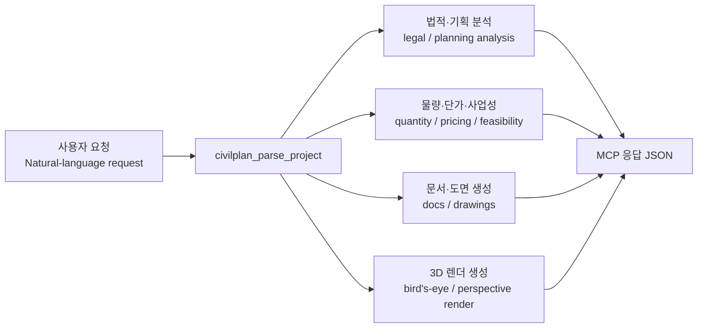

# CivilPlan MCP v2.0.0

한국형 토목·건축 프로젝트 기획을 MCP 도구로 구조화하고 문서·도면·3D 렌더까지 생성하는 서버입니다.  
CivilPlan MCP is an MCP server for Korean civil and building project planning that produces structured analysis, documents, drawings, and 3D renders.

[](LICENSE)
[](https://python.org)
[](https://github.com/jlowin/fastmcp)
[](pyproject.toml)

## 소개 | Introduction

CivilPlan MCP는 자연어 프로젝트 설명을 받아 인허가 검토, 물량 산정, 단가 조회, 투자 문서 작성, SVG/DXF 도면 생성, 3D Bird's-Eye View 렌더링까지 연결하는 20개 MCP 도구를 제공합니다.  
CivilPlan MCP provides 20 MCP tools that turn natural-language project requests into permit reviews, quantity takeoff, pricing, planning documents, SVG/DXF drawings, and 3D bird's-eye renders.

주요 흐름은 `프로젝트 파싱 → 법적·사업성 검토 → 산출물 생성`입니다.  
The core flow is `project parsing → legal/financial review → output generation`.



## 누가 쓰면 좋은가 | Who Is This For

| 대상 Audience | 쓰는 이유 Why |
|---|---|
| 지자체·공공 발주 담당자<br/>Local government and public-sector planners | 초기 타당성, 절차, 예산 초안이 빠르게 필요할 때 사용합니다.<br/>Use it when you need a fast first-pass on feasibility, procedures, and budget. |
| 토목·건축 엔지니어<br/>Civil and building engineers | 기획 단계 물량, 단가, 문서 초안을 자동화할 수 있습니다.<br/>Automate early-stage quantity takeoff, pricing, and planning documents. |
| 개발사업 기획자<br/>Development planners | 자연어 설명만으로 구조화된 프로젝트 데이터와 시각 자료를 얻을 수 있습니다.<br/>Turn a plain-language project brief into structured project data and visuals. |
| AI 에이전트 운영자<br/>AI agent builders | Claude, ChatGPT, 기타 MCP 클라이언트에 토목/건축 전용 도구 세트를 연결할 수 있습니다.<br/>Attach a Korean construction-planning toolset to Claude, ChatGPT, and other MCP clients. |

## 주요 기능 | Key Features

### v2.0.0 변경점 | What's New in v2.0.0

| 항목 Item | 설명 Description |
|---|---|
| `civilplan_generate_birdseye_view` | Gemini 기반 3D Bird's-Eye View와 Perspective View를 한 번에 생성합니다.<br/>Generates Gemini-based bird's-eye and perspective renders in one call. |
| `GEMINI_API_KEY` 설정 | `.env`와 Windows DPAPI 기반 `setup_keys.py` 양쪽에서 Gemini 키를 읽습니다.<br/>Reads the Gemini key from both `.env` and Windows DPAPI-based `setup_keys.py`. |
| 도메인 프롬프트 템플릿 | 도로, 건축, 상하수도, 하천, 조경, 복합 프로젝트별 렌더 문구를 분리했습니다.<br/>Adds domain-specific render prompts for road, building, water, river, landscape, and mixed projects. |
| 총 20개 MCP 도구 | 기존 기획/문서/도면 도구에 3D 시각화를 추가했습니다.<br/>Expands the server to 20 MCP tools by adding 3D visualization. |

### 도구 목록 | Tool Catalog

#### 기획·분석 도구 | Planning and Analysis Tools

| 도구 Tool | 설명 Description |
|---|---|
| `civilplan_parse_project` | 자연어 프로젝트 설명을 구조화된 JSON으로 변환합니다.<br/>Parses a natural-language project brief into structured JSON. |
| `civilplan_get_legal_procedures` | 사업 조건에 맞는 인허가·환경 절차를 정리합니다.<br/>Finds permit and environmental procedures for the project. |
| `civilplan_get_phase_checklist` | 단계별 체크리스트를 생성합니다.<br/>Builds phase-by-phase execution checklists. |
| `civilplan_evaluate_impact_assessments` | 영향평가 필요 여부를 검토합니다.<br/>Evaluates impact-assessment requirements. |
| `civilplan_estimate_quantities` | 개략 물량을 산정합니다.<br/>Estimates conceptual quantities. |
| `civilplan_get_unit_prices` | 지역 보정이 반영된 단가를 조회합니다.<br/>Looks up unit prices with regional adjustments. |
| `civilplan_get_applicable_guidelines` | 적용 대상 설계 기준을 찾습니다.<br/>Finds applicable design guidelines. |
| `civilplan_fetch_guideline_summary` | 기준 전문의 핵심 항목을 요약합니다.<br/>Fetches summaries of guideline references. |
| `civilplan_select_bid_type` | 발주·입찰 방식을 추천합니다.<br/>Recommends a bidding/procurement method. |
| `civilplan_estimate_waste_disposal` | 건설폐기물 물량과 처리비를 계산합니다.<br/>Estimates construction waste volume and disposal cost. |
| `civilplan_query_land_info` | 토지·지목·용도지역 정보를 조회합니다.<br/>Queries land, parcel, and zoning information. |
| `civilplan_analyze_feasibility` | IRR, NPV, DSCR 등 사업성을 계산합니다.<br/>Calculates IRR, NPV, DSCR, and related feasibility metrics. |
| `civilplan_validate_against_benchmark` | 공공 기준이나 벤치마크와 비교합니다.<br/>Checks estimates against public benchmarks. |

#### 문서·도면 도구 | Document and Drawing Tools

| 도구 Tool | 설명 Description |
|---|---|
| `civilplan_generate_boq_excel` | BOQ Excel 파일을 생성합니다.<br/>Generates a BOQ Excel workbook. |
| `civilplan_generate_investment_doc` | 투자·사업계획 Word 문서를 생성합니다.<br/>Generates an investment/planning Word document. |
| `civilplan_generate_budget_report` | 예산 보고서를 작성합니다.<br/>Builds a budget report document. |
| `civilplan_generate_schedule` | 일정표 Excel 파일을 생성합니다.<br/>Creates a schedule workbook. |
| `civilplan_generate_svg_drawing` | SVG 개략 도면을 생성합니다.<br/>Generates conceptual SVG drawings. |
| `civilplan_generate_dxf_drawing` | DXF CAD 도면을 생성합니다.<br/>Generates DXF CAD drawings. |
| `civilplan_generate_birdseye_view` | Bird's-Eye / Perspective PNG 렌더를 생성합니다.<br/>Generates bird's-eye and perspective PNG renders. |

### 지원 도메인 | Supported Domains

| 도메인 Domain | 설명 Description |
|---|---|
| `토목_도로` | 도로, 진입로, 포장, 차선 중심 프로젝트<br/>Roads, access roads, pavement, lane-focused projects |
| `건축` | 건물, 복지관, 학교, 오피스 등 건축 프로젝트<br/>Buildings, welfare centers, schools, offices, and similar building projects |
| `토목_상하수도` | 상수도, 하수도, 우수도, 관로 중심 프로젝트<br/>Water, sewer, stormwater, and pipeline-centric projects |
| `토목_하천` | 하천 정비, 제방, 배수, 수변 구조물 프로젝트<br/>River improvement, levee, drainage, and riverside structure projects |
| `조경` | 공원, 녹지, 식재, 휴게 공간 프로젝트<br/>Landscape, parks, planting, and open-space projects |
| `복합` | 다분야가 섞인 복합 개발 프로젝트<br/>Mixed multi-domain development projects |

## 빠른 시작 가이드 | Quick Start Guide

### 1. 저장소 받기 | Clone the Repository

```bash
git clone https://github.com/sinmb79/Construction-project-master.git
cd Construction-project-master
python -m venv .venv
```

### 2. 가상환경 활성화와 패키지 설치 | Activate the Environment and Install Dependencies

```bash
# Windows
.venv\Scripts\activate

# macOS / Linux
source .venv/bin/activate

python -m pip install -r requirements.txt
```

### 3. API 키 설정 | Configure API Keys

| 방법 Method | 명령 Command | 설명 Description |
|---|---|---|
| `.env` 파일 | `copy .env.example .env` (Windows)<br/>`cp .env.example .env` (macOS/Linux) | 로컬 개발용으로 가장 단순합니다.<br/>The simplest option for local development. |
| 암호화 저장소 | `python setup_keys.py` | Windows DPAPI에 키를 암호화 저장합니다.<br/>Stores keys in Windows DPAPI-encrypted storage. |

`.env` 예시는 아래와 같습니다.  
An example `.env` looks like this.

```env
DATA_GO_KR_API_KEY=
VWORLD_API_KEY=
GEMINI_API_KEY=
```

### 4. 서버 실행 | Start the Server

```bash
python server.py
```

실행 주소는 `http://127.0.0.1:8765/mcp` 입니다.  
The server runs at `http://127.0.0.1:8765/mcp`.

### 5. MCP 클라이언트 연결 | Connect an MCP Client

#### Claude Code

```bash
claude mcp add --transport http civilplan http://127.0.0.1:8765/mcp
```

#### Claude Desktop

| 항목 Item | 값 Value |
|---|---|
| 서버 유형 Server type | HTTP MCP server |
| URL | `http://127.0.0.1:8765/mcp` |
| Windows 설정 파일 Common Windows config path | `%APPDATA%\Claude\claude_desktop_config.json` |

HTTP MCP 서버를 추가한 뒤 Claude Desktop을 재시작하세요.  
Add the HTTP MCP server and restart Claude Desktop.

#### ChatGPT Developer Mode

| 단계 Step | 설명 Description |
|---|---|
| 1 | ChatGPT에서 `Settings → Apps → Advanced settings → Developer mode`를 켭니다.<br/>Enable `Settings → Apps → Advanced settings → Developer mode` in ChatGPT. |
| 2 | `Create app`를 눌러 원격 MCP 서버를 등록합니다.<br/>Click `Create app` to register a remote MCP server. |
| 3 | 로컬 서버는 직접 연결되지 않으므로 터널 URL이 필요합니다.<br/>Local servers cannot be connected directly, so you need a tunnel URL. |

`cloudflared` 예시는 아래와 같습니다.  
An example `cloudflared` tunnel command is shown below.

```bash
cloudflared tunnel --url http://127.0.0.1:8765
```

터널이 만든 HTTPS URL을 ChatGPT 앱 생성 화면에 넣으세요.  
Use the HTTPS URL produced by the tunnel when creating the ChatGPT app.

#### 기타 MCP 클라이언트 | Other MCP Clients

| 항목 Item | 값 Value |
|---|---|
| 프로토콜 Protocol | Streaming HTTP |
| URL | `http://127.0.0.1:8765/mcp` |

## 실전 사용 예시 | Real-World Usage Examples

### 예시 1: 도로 프로젝트 파싱 | Example 1: Parse a Road Project

**AI에게 이렇게 말하세요 | Say this to the AI**

```text
도로 신설 L=890m B=6m 아스콘 2차선 상하수도 경기도 화성시 2026~2028
```

**호출되는 도구 | Tool called**

```python
civilplan_parse_project(
    description="도로 신설 L=890m B=6m 아스콘 2차선 상하수도 경기도 화성시 2026~2028"
)
```

**결과 예시 | Example result**

```json
{
  "project_id": "PRJ-20260404-001",
  "domain": "토목_도로",
  "sub_domains": ["토목_상하수도"],
  "project_type": ["도로", "하수도"],
  "road": {
    "length_m": 890.0,
    "width_m": 6.0,
    "lanes": 2,
    "pavement": "아스콘"
  },
  "region": "경기도",
  "year_start": 2026,
  "year_end": 2028,
  "parsed_confidence": 0.92
}
```

### 예시 2: 인허가 절차 확인 | Example 2: Check Legal Procedures

**AI에게 이렇게 말하세요 | Say this to the AI**

```text
경기도 공공 도로 사업(총사업비 10.67억, 연장 890m)에 필요한 인허가를 정리해줘
```

**호출되는 도구 | Tool called**

```python
civilplan_get_legal_procedures(
    domain="토목_도로",
    project_type="도로",
    total_cost_billion=10.67,
    road_length_m=890,
    development_area_m2=None,
    region="경기도",
    has_farmland=False,
    has_forest=False,
    has_river=False,
    is_public=True
)
```

**결과 예시 | Example result**

```json
{
  "summary": {
    "total_procedures": 3,
    "mandatory_count": 2,
    "optional_count": 1,
    "estimated_prep_months": 12,
    "critical_path": [
      "도시·군관리계획 결정",
      "개발행위허가",
      "소규모환경영향평가"
    ]
  },
  "timeline_estimate": {
    "인허가완료목표": "착공 18개월 전"
  }
}
```

### 예시 3: SVG 도면 생성 | Example 3: Generate an SVG Drawing

**AI에게 이렇게 말하세요 | Say this to the AI**

```text
위 프로젝트로 개략 평면도 SVG를 만들어줘
```

**호출되는 도구 | Tool called**

```python
civilplan_generate_svg_drawing(
    drawing_type="평면도",
    project_spec=project_spec,
    quantities=quantities,
    scale="1:200",
    output_filename="road-plan.svg"
)
```

**결과 예시 | Example result**

```json
{
  "status": "success",
  "file_path": "output/road-plan.svg",
  "drawing_type": "평면도",
  "quantity_sections": ["earthwork", "pavement", "drainage"]
}
```

### 예시 4: Bird's-Eye View 렌더 생성 | Example 4: Generate a Bird's-Eye Render

**AI에게 이렇게 말하세요 | Say this to the AI**

```text
이 도로 사업을 발표용 3D 조감도와 사람 시점 투시도로 만들어줘
```

**호출되는 도구 | Tool called**

```python
civilplan_generate_birdseye_view(
    project_summary="경기도 화성시 도로 신설 890m, 폭 6m, 2차선 아스콘 포장, 상하수도 포함",
    project_spec=project_spec,
    svg_drawing="<svg>...</svg>",
    resolution="2K"
)
```

**결과 예시 | Example result**

```json
{
  "status": "success",
  "project_id": "PRJ-20260404-001",
  "model": "gemini-3-pro-image-preview",
  "resolution": "2K",
  "reference_image_path": "output/PRJ-20260404-001_reference.png",
  "birdseye_view": {
    "status": "success",
    "path": "output/PRJ-20260404-001_birdseye.png"
  },
  "perspective_view": {
    "status": "success",
    "path": "output/PRJ-20260404-001_perspective.png"
  }
}
```

## 프로젝트 구조 | Project Structure

```text
Construction-project-master/
├─ server.py                      # 서버 실행 진입점 | Server entrypoint
├─ setup_keys.py                  # 암호화 키 저장 유틸 | Encrypted key setup helper
├─ requirements.txt               # 런타임 의존성 | Runtime dependencies
├─ pyproject.toml                 # 패키지 메타데이터 | Package metadata
├─ README.md                      # 사용 가이드 | Usage guide
├─ civilplan_mcp/
│  ├─ __init__.py                 # 버전 정보 | Version metadata
│  ├─ config.py                   # 설정·경로·API 키 로딩 | Settings, paths, API key loading
│  ├─ models.py                   # 도메인 enum | Domain enums
│  ├─ secure_store.py             # DPAPI 키 저장 | DPAPI-backed key store
│  ├─ prompts/
│  │  └─ birdseye_templates.py    # 도메인별 렌더 프롬프트 | Domain-specific render prompts
│  ├─ services/
│  │  └─ gemini_image.py          # Gemini 이미지 래퍼 | Gemini image wrapper
│  ├─ tools/
│  │  ├─ birdseye_generator.py    # 3D 렌더 도구 | 3D rendering tool
│  │  ├─ drawing_generator.py     # SVG 도면 생성 | SVG drawing generator
│  │  ├─ dxf_generator.py         # DXF 도면 생성 | DXF drawing generator
│  │  └─ ...                      # 나머지 MCP 도구 | Remaining MCP tools
│  ├─ data/                       # 기준 JSON 데이터 | Reference JSON data
│  ├─ db/                         # SQLite schema/bootstrap | SQLite schema/bootstrap
│  └─ updater/                    # 데이터 갱신 로직 | Data update logic
└─ tests/
   ├─ test_config_and_secure_store.py
   ├─ test_gemini_image.py
   ├─ test_birdseye_templates.py
   ├─ test_birdseye_generator.py
   └─ ...                         # 전체 회귀 테스트 | Full regression tests
```

## 자주 겪는 문제 | FAQ and Troubleshooting

| 문제 Problem | 확인 방법 What to Check | 해결 방법 Fix |
|---|---|---|
| `GEMINI_API_KEY is not configured` | `.env` 또는 `setup_keys.py` 저장 여부를 확인합니다.<br/>Check `.env` or whether `setup_keys.py` stored the key. | `GEMINI_API_KEY`를 입력하고 서버를 재시작합니다.<br/>Add `GEMINI_API_KEY` and restart the server. |
| ChatGPT에서 localhost 연결 실패 | ChatGPT는 로컬 URL을 직접 쓰지 못합니다.<br/>ChatGPT cannot use a localhost URL directly. | `cloudflared` 또는 `ngrok`로 HTTPS 터널을 노출합니다.<br/>Expose the server through an HTTPS tunnel such as `cloudflared` or `ngrok`. |
| Claude Code에서 도구가 안 보임 | `claude mcp list`로 등록 상태를 확인합니다.<br/>Use `claude mcp list` to verify registration. | `claude mcp add --transport http civilplan http://127.0.0.1:8765/mcp`를 다시 실행합니다.<br/>Re-run the HTTP MCP registration command. |
| SVG 참고 이미지가 반영되지 않음 | `cairosvg` 설치 여부와 SVG 문자열 유효성을 확인합니다.<br/>Check whether `cairosvg` is installed and the SVG string is valid. | 잘못된 SVG면 텍스트 전용 렌더로 fallback 됩니다.<br/>If SVG conversion fails, the tool falls back to text-only rendering. |
| 전체 테스트를 다시 돌리고 싶음 | 아래 명령을 사용합니다.<br/>Use the following command. | `python -m pytest tests/ -q` |

## 알려진 제한사항 | Known Limitations

| 항목 Item | 설명 Description |
|---|---|
| 기획 단계 정확도 | 모든 수치와 절차는 개략 검토용입니다.<br/>All numbers and procedures are intended for conceptual planning only. |
| 3D 렌더 의존성 | `civilplan_generate_birdseye_view`는 인터넷 연결과 `GEMINI_API_KEY`가 필요합니다.<br/>`civilplan_generate_birdseye_view` requires internet access and a `GEMINI_API_KEY`. |
| 토지 정보 | 일부 토지 데이터는 외부 API 상태에 따라 결과가 달라질 수 있습니다.<br/>Some land information depends on external API availability. |
| 조경·복합 도메인 | 프롬프트와 절차 데이터가 계속 보강 중입니다.<br/>Landscape and mixed-domain support is still being expanded. |
| 공개 제출 문서 | 생성 결과는 공식 제출 문서가 아닙니다.<br/>Generated outputs are not valid submission documents. |

## 면책사항 | Disclaimer

> 본 저장소의 결과물은 기획 단계 참고자료이며, 상세 설계·발주·공식 제출용 문서를 대체하지 않습니다.  
> Outputs from this repository are planning-stage references and do not replace detailed design, procurement, or official submission documents.

## 라이선스 | License

| 항목 Item | 내용 Detail |
|---|---|
| 라이선스 License | MIT |
| 사용 범위 Usage | 사용, 수정, 배포 가능<br/>Free to use, modify, and distribute |

## 만든 사람 | Author

| 항목 Item | 내용 Detail |
|---|---|
| 팀 Team | **22B Labs** |
| 저장소 Repository | [sinmb79/Construction-project-master](https://github.com/sinmb79/Construction-project-master) |
| 문의 Contact | [Issues](https://github.com/sinmb79/Construction-project-master/issues) |
